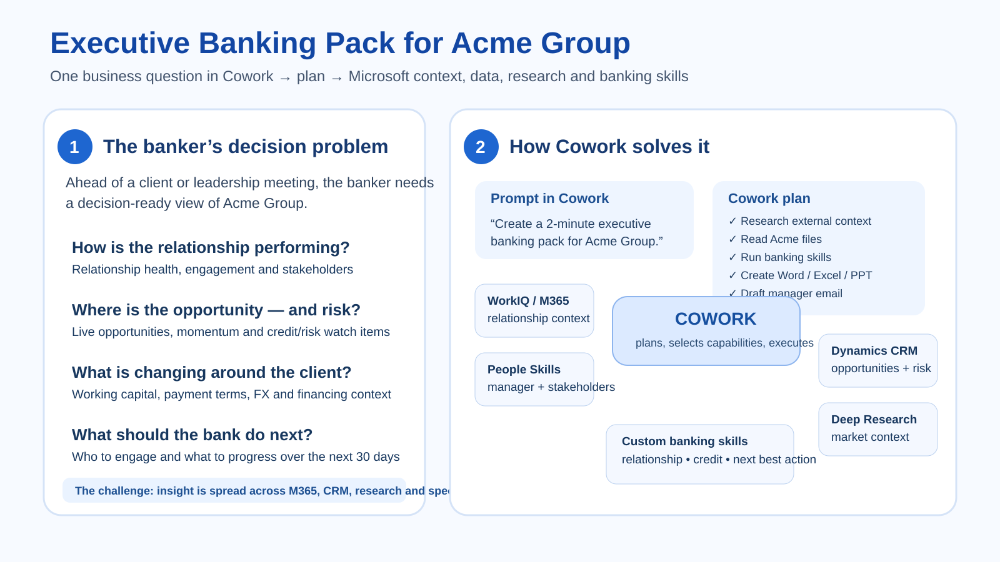
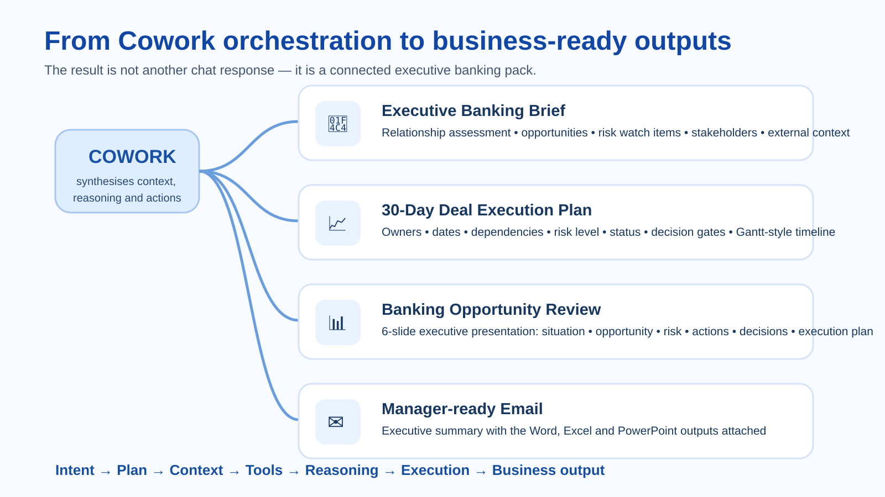

# Microsoft Cowork – Executive Banking Demo

A reproducible **synthetic financial-services demo** showing how Microsoft Cowork can take a banking outcome, plan the work, combine enterprise context with research and specialist skills, and produce decision-ready business artifacts.

> **Important:** Acme Group and every person, opportunity, financial figure and risk signal in this repository are fictional and created solely for demonstration purposes. No real client or confidential information is included.

## The banking problem

A relationship banker is preparing for an important Acme Group meeting and needs a decision-ready view of:

- How is the relationship performing?
- Where are the live opportunities?
- What credit/risk issues need attention?
- Who are the key decision makers?
- What is changing in the market?
- What should the bank do over the next 30 days?

Instead of manually moving between systems, the banker starts with one request in Cowork:

> **Create a 2-minute executive banking pack for Acme Group.**

## How the demo works



Cowork plans the work and can bring together:

- **WorkIQ / Microsoft 365 context** – relationship history and engagement context
- **People Skills** – manager and stakeholder context
- **Dynamics CRM** – live opportunities, risk items and decision makers
- **Deep Research** – external market context on working capital, payment terms, FX and financing
- **Custom banking skills** – relationship briefing, credit review and banker next best action

## Business outputs



The workflow produces four connected outputs:

1. **Acme Group Executive Banking Brief** – Word
2. **Acme Group 30-Day Deal Execution Plan** – Excel
3. **Acme Group Banking Opportunity Review** – 6-slide PowerPoint
4. **Manager-ready email** – executive summary with the three files attached

## Watch the demo

Full walkthrough: https://www.loom.com/share/de94a1198dea4ea0921754e8d6c988b4

## Try the scenario

1. Review the synthetic files under [`synthetic-data/`](synthetic-data/).
2. Copy the prompt from [`prompt/cowork-executive-banking-pack-prompt.md`](prompt/cowork-executive-banking-pack-prompt.md).
3. Adapt the three example skills under [`skills/`](skills/).
4. Place the synthetic data in the location your Cowork environment can access.
5. Run the prompt and compare the generated outputs with the target workflow above.

## Repository structure

```text
microsoft-cowork-banking-demo/
├── README.md
├── LICENSE
├── prompt/
│   └── cowork-executive-banking-pack-prompt.md
├── synthetic-data/
│   ├── 01-acme-group-client-profile.md
│   ├── 02-acme-group-meeting-notes.md
│   ├── 03-acme-group-opportunity-pipeline.csv
│   ├── 04-acme-group-credit-snapshot.md
│   ├── 05-internal-email-simulation.md
│   └── 06-acme-group-execution-context.md
├── skills/
│   ├── cib-relationship-briefing/SKILL.md
│   ├── credit-risk-review/SKILL.md
│   └── banker-next-best-action/SKILL.md
├── images/
│   ├── 01-cowork-orchestration.svg
│   └── 02-cowork-outputs.svg
└── sample-output/
    └── README.md
```

## Notes

This repository is intended as a **demo scaffold**, not production banking logic. Replace synthetic data, skill logic and governance controls with your organisation's approved sources, controls and operating model before using a similar pattern in a real environment.
